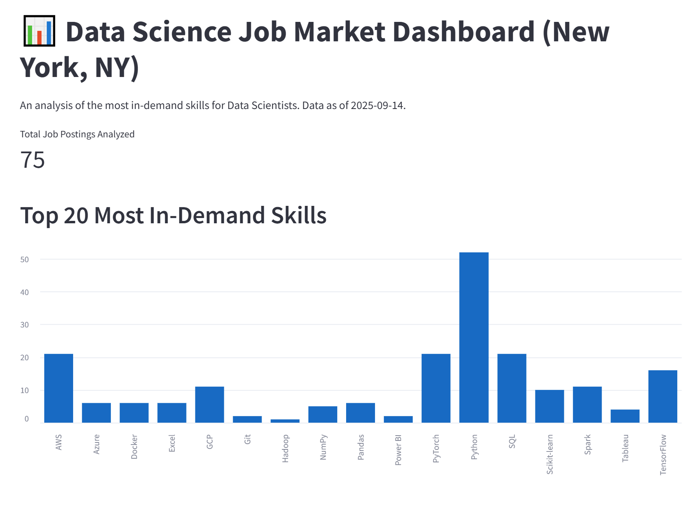

# Data Science Job Skills Analyzer

## Live Demo

**[View the live application here!](https://job-skills-scraper.streamlit.app/)**

---

## Project Description

This project is a web application that scrapes, analyzes, and visualizes the most in-demand technical skills for Data Scientist roles in New York, NY. The data is collected from Indeed.com and presented in an interactive dashboard built with Streamlit.

The application uses a semi-automated data pipeline: the scraping is performed locally to handle CAPTCHAs, and the resulting database is pushed to this repository. The live Streamlit app, hosted on Streamlit Community Cloud, reads this database to serve the analysis.

## Tech Stack

* **Data Collection:** Python, Playwright, BeautifulSoup (within Playwright)
* **Data Processing:** Pandas
* **Database:** SQLite
* **Backend API:** FastAPI, Uvicorn
* **Frontend Dashboard:** Streamlit
* **Deployment:** Streamlit Community Cloud

## Screenshot



---

## How to Run Locally

1.  **Clone the repository:**
    ```bash
    git clone [https://github.com/jjezttt/job_skills_scraper.git](https://github.com/jjezttt/job_skills_scraper.git)
    cd ob_skills_scraper
    ```

2.  **Create and activate a virtual environment:**
    ```bash
    # On Windows
    py -m venv venv
    venv\Scripts\activate
    ```

3.  **Install dependencies:**
    ```bash
    pip install -r requirements.txt
    playwright install
    ```

4.  **(Optional) Run the data pipeline to get fresh data:**
    *Note: This will open a browser window and may require you to solve a CAPTCHA.*
    ```bash
    python pipeline.py
    ```

5.  **Run the application:**
    * In one terminal, start the API: `uvicorn api:app --reload`
    * In a second terminal, start the frontend: `streamlit run app.py`